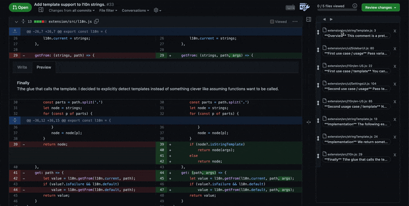

# <picture></picture> Tell Request

Guide reviewers through your pull requests with this chrome extension.

## What is a tell request?

A Tell Request is a collection of comments and visual cues applied to a pull request, presented in a suggested viewing order. You are asking someone to let you tell them about your changes before they pull.

In a traditional pull request, you are presented with a set of file diffs and perhaps a comment explaining them, but it is left to the reader to figure out how to make sense of it beyond that.

## Why is a tell request?

Code review is integral to modern software development and yet is often an afterthought or a chore: from the writer's perspective responsibility is sometimes taken to end with pushing the new code; from the reader's perspective it can be daunting to be presented with a set of changes and be expected to figure out how it all fits together.

Modern tooling attack the problem in very dry ways that are artifacts of the underlying tech, for example diffs and commits, which provide a lot of information locally, but do a poor job of telling you how each piece connects in the larger whole - think of how people solve jigsaw puzzles: initially, knowing a piece is part of the skyline is more helpful than its specific contour.

Actually there are many ways of facilitating the process:
* Adding a good summary comment to the pull request
* Adding your own expository line-comments to the pull request ahead of any review
* Having logical, progressive, digestable commits (and commit messages)
* Limiting the amount of overall changes
* Limiting the scope and complexity of the overall changes
* Linking to relevant documentation / requirements / context
* Presenting the changes in a meeting

These are all useful tools that maybe you already use, and a Tell Request is one more.

## Documentation

Read the guide / documentation: [GettingStarted.md](docs/guide/GettingStarted.md)

Once you've installed the plugin, checkout some [examples](pulls?q=is%3Aopen+is%3Apr+label%3Aexample)