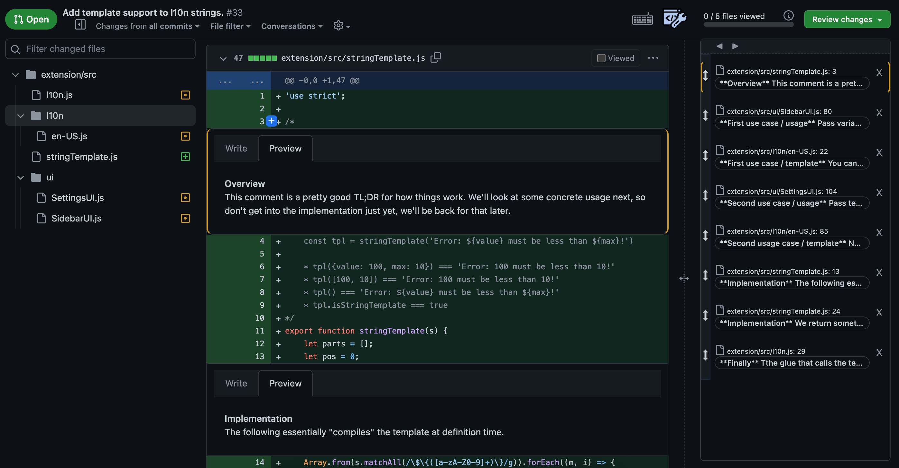
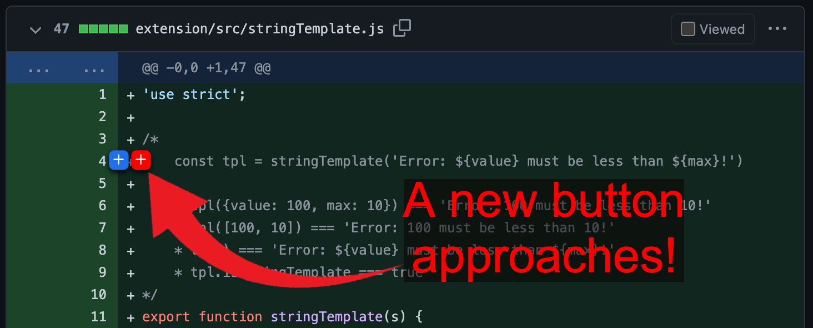
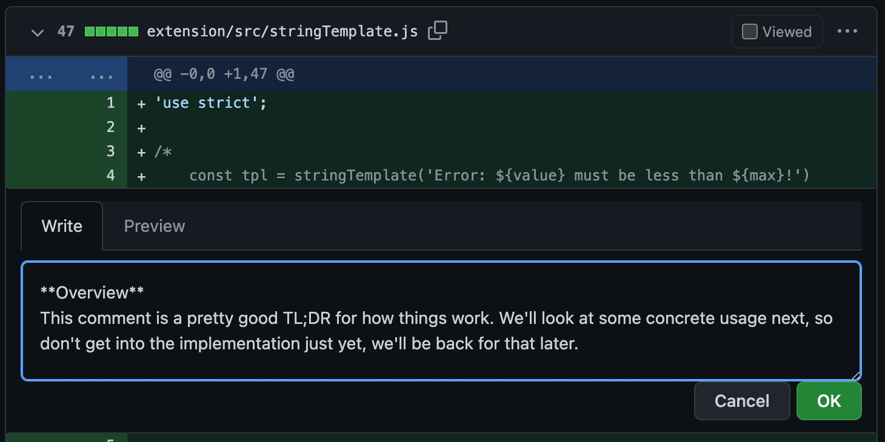
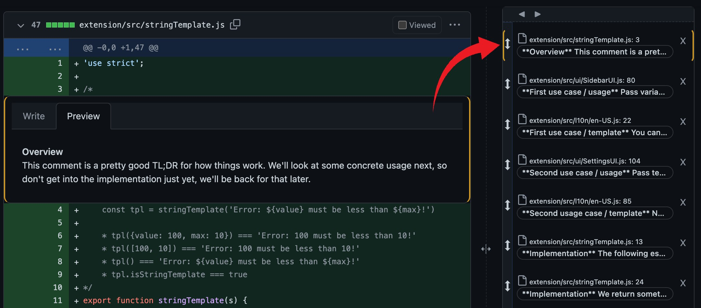
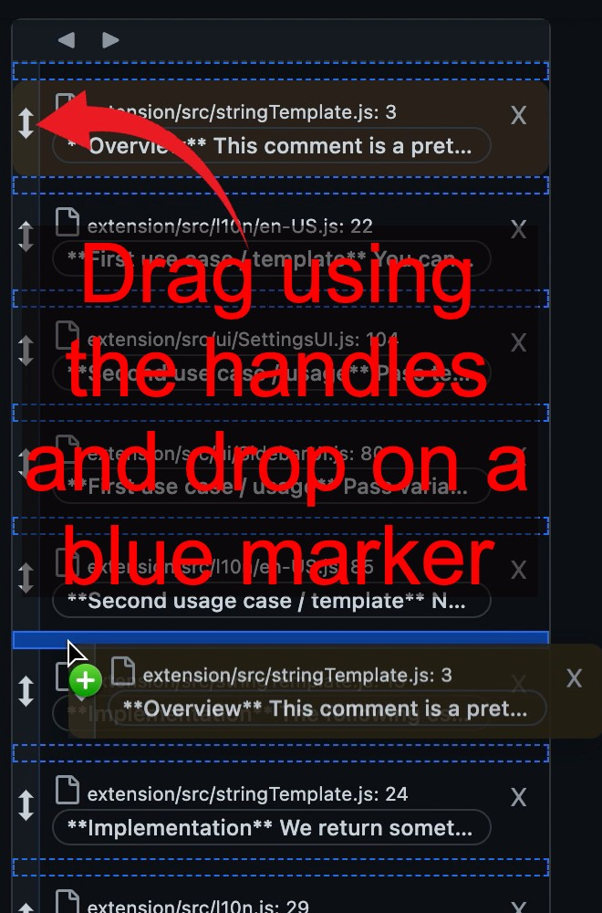
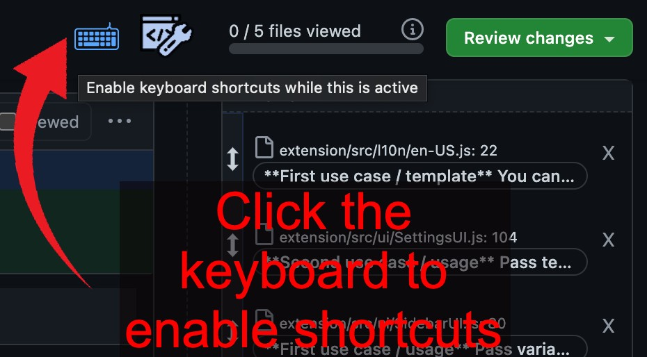
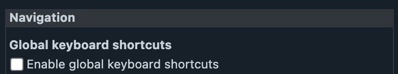
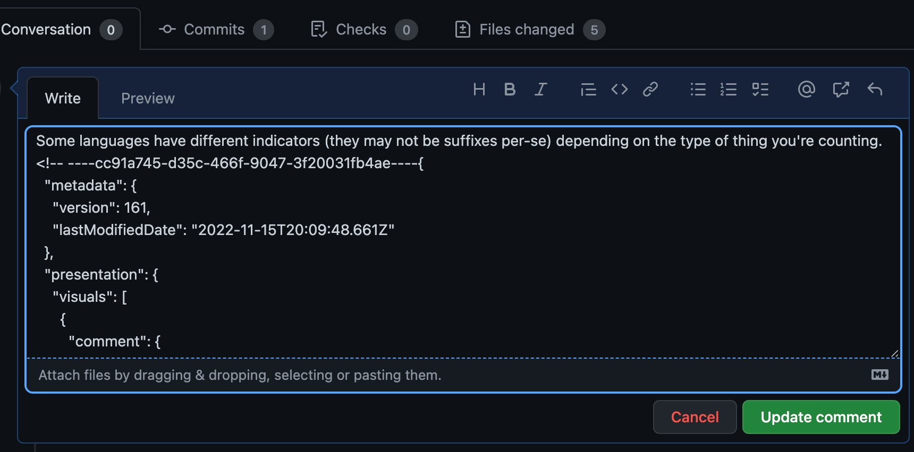

# Getting Started

Layout of a Tell Request:

A tell request is all about providing a tour of the changes that is as much about pointing things out as it is about the order in which you do so.

Sometimes this can be as simple as:
1. Here's an interface defining a contract
1. Look at these tests explaining it's use cases
1. Please scrutinize the implementation details

But in real life there can be some back and forth and some incidental changes along the way.

# Comments

Comments you add with Tell Request serve two purposes: explaining and ordering. They appear inline similar to regular Github comments, as well as in the Sidebar.

The Sidebar shows the order of the comments, and users can navigate the request using the Sidebar or keyboard shortcuts.

## Adding comments

Tell Request adds a new button next to the regular Github "Add a comment" button.

Clicking this button will add a familiar editing interface.

Comments you add appear in the sidebar in an order of your choosing.

## Ordering Comments

You can put comments in the order of your choosing by dragging the handle to the left of each item int he Sidebar. When you start dragging, indicators will show you where you can drop.

# Navigating

You can navigate a Tell Request using the back and forth buttons on the sidebar as well as keyboard shortcuts.

## Via the sidebar

The previous and next buttons on the sidebar can be used to navigate.

## Via keyboard shortcuts

There are two kinds of keyboard shortcuts: local and global. If you've ever used Jira, you know what a minefield the keyboard can become when every key is mapped to some functionality.

ℹ️ The default keybindings for navigation are Left Arrow and Right Arrow.

### Local shortcuts

Local shortcuts is a button you can click. As long as you don't click away or otherwise de-focus the button, keyboard shortcuts will be active. As soon as you do anything else they will deactivate.

### Global shortcuts

You may also enable shortcuts globally in the settings. Global shortcuts are always activated.

# Saving / Data Persistance

The data model for a Tell Request is kept separate from regular Github elements. In particular, Tell comments are not regular Github comments.

All data for a Tell Request is saved as hidden markdown in the pull requests main comment.

This is how the experience is shared among users.

# Browser Extension / Permissions

The browser extension does the following:

## Modify Github's HTML

The plugin adds new and modifies existing UI elements on Github.

## Persist information in your browser

Your preferences are saved to browser storage.

## Call Github's API on your behalf

The following functionality performs calls to Github on your behalf using your browser session:

* Preview
* Save / Load
